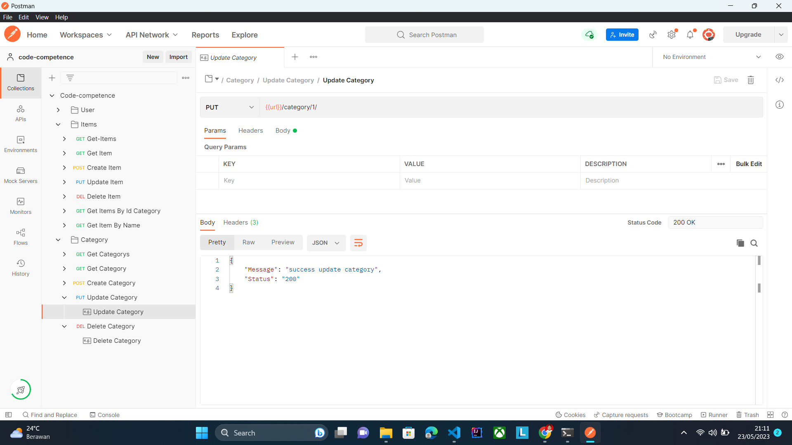
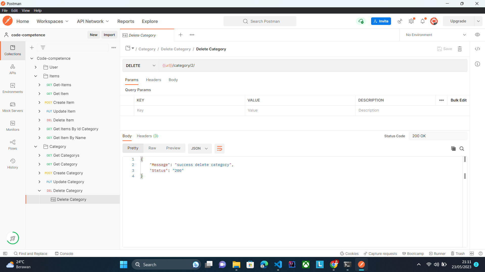

**LOGGING MIDDLEWARE**

---

**REGISTER USER**

---

**LOGIN USER**

---

**CREATE ITEM**

---

**GET ITEMS**

---

**GET ITEM**

---

**UPDATE ITEM**

---

**DELETE ITEM**

---

**GET ITEMS BY ID CATEGORY**

---

**GET ITEM BY NAME**

---

**CREATE CATEGORY**

---

**GET CATEGORYS**

---

**GET CATEGORY**

---

**UPDATE CATEGORY**

---

**DELETE CATEGORY**

